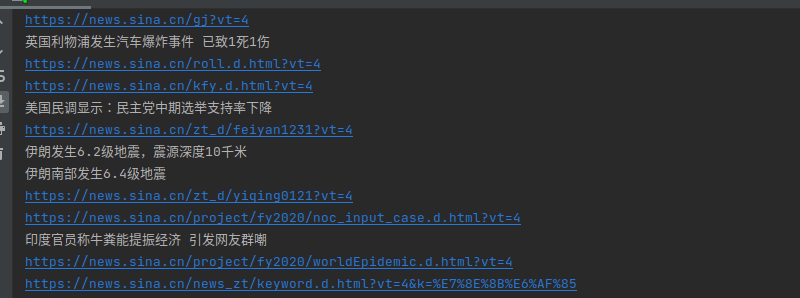
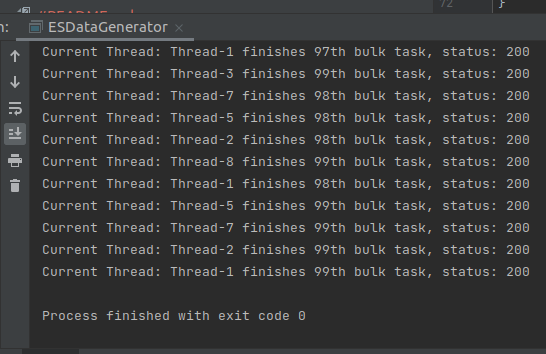
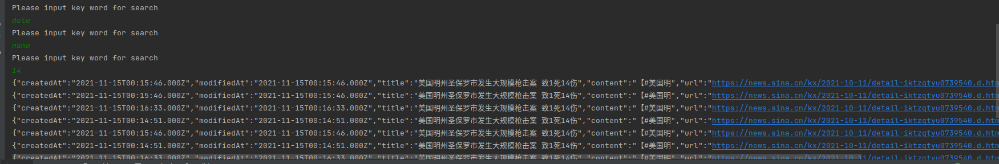

# Multi-Threaded Web Crawler & News Search Engine
a web crawler targeting at fetching new info from [sina](https://sina.cn/)
and a serach engine abling to search keywords among the news fetched by the crawler.

# Demo

# How to Run

1. Dowload code onto your computer and unzip it

2. Prepare Database
    + Install Docker on your computer
    + Download MySQL docker image
    + Run MySQL with Docker:
      `docker run  -v TheFilePathOfWhereYouDownloadTheCode/XDML-crawler/db.mysql:/var/lib/mysql -p 3306:3306 -e MYSQL_ROOT_PASSWORD=jianqi -d mysql:VersionNumber`
    + Use Flyway to initialize database:
      `mvn flyway:migrate`
    + Clean up Database(optional):  
      `mvn flyway:clean`

3. Run the Code
    + Web Crawler:
      Open pom.xml with IDEA and run Main

    + New Search Engine
        + Download ElasticSearch docker image
        + Run ElasticSearch with Docker
          `docker run -d -p 9200:9200  -e "discovery.type=single-node" elasticsearch:VersionNumber`
        + run ESDataGenerator in IDEA
        + run ElasticSearchEngine in IDEA
